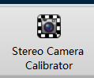
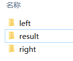
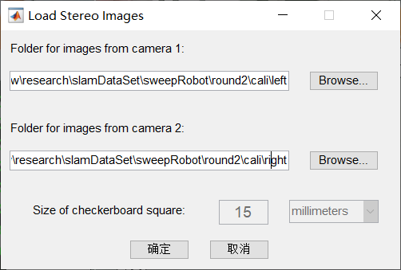
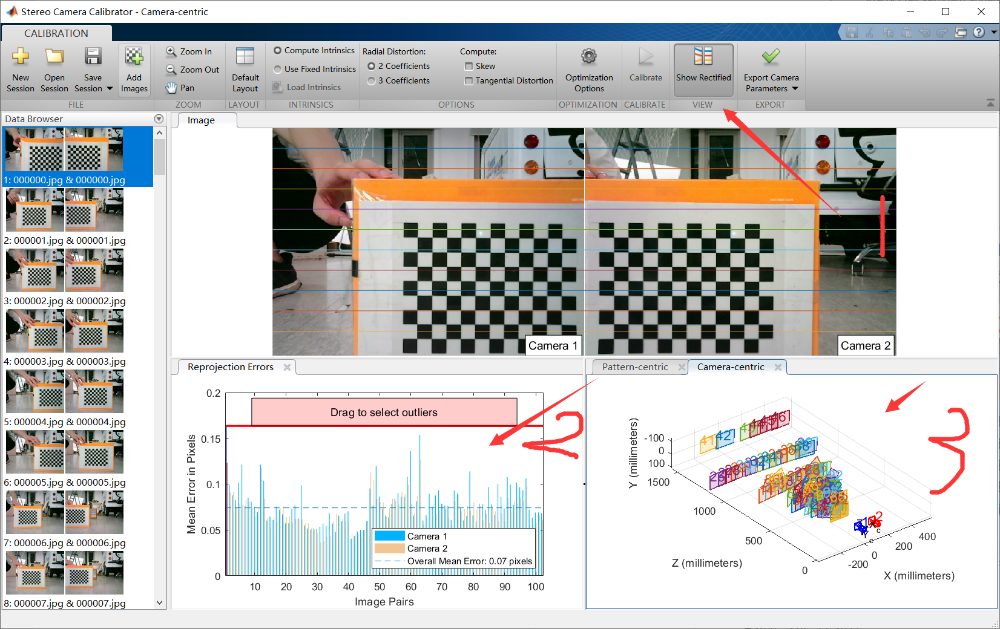
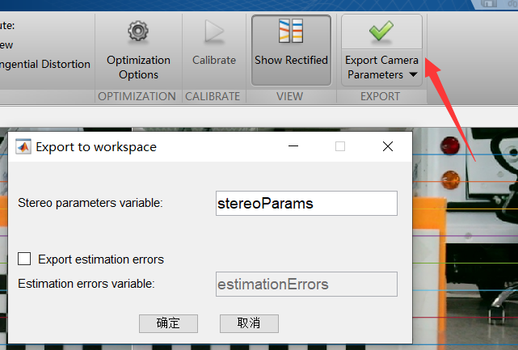

OpenCV和MATLAB均能对双目相机进行标定，但两者都各有优缺点。OpenCV标定的结果更方便加载到程序里，但其操作复杂。MATLAB双目标定箱具有更好的用户交互功能，但其结果不能直接被应用到CMAKE工程里。本文提供一套利用MATLAB标定双目，并将结果导入OpenCV的方案，并附上[code](https://github.com/qiaozhijian/stereo_calibr.git)，勿忘Star。

#### MATLAB标定步骤

1. 安装MATLAB（版本2018a） 标定工具箱，先安装图像处理工具箱，再安装计算机视觉工具箱，APP栏即有如下图标

<div align=center></div>

2. 采集远近方位各个不同的图片。原因是标定算法是基于优化的，样本的多样和数量可以让优化效果更好。分别用left和right两
个子文件夹存放左右目图像。

<div align=center></div>

3. 导入图像到MATLAB标定工具箱。并根据实际情况设定黑白方格边长。这个时候MATLAB就自动检测角点，去除不完整的图片了。
<div align=center></div>

4. 解释一下标定界面。
    1. 是否使用先前标定好的相机参数，如果使用，存入箭头5指向的地方
    2. 畸变参数的不同表达形式（3个参数表达往往更精准）
    3. 是否认为图像坐标系x和y轴是垂直的，如果勾选，那内参矩阵会有细微变化，可以自己观察一下
    4. 是否计算切向畸变
    5. 优化预设参数（内参矩阵）
    6. 开始标定
<div align=center></div>
5. 解释一下标定界面。

  1. 展示标定后结果图
  2. 每对图像标定误差，可以鼠标点击或者拉上面的红线进行选中，把误差大的删除
  3. 观察相机和标定板的相对位姿分布，分布越多越好的，如图远近和角度都有不同的分布。但太远了也看不清，又是另外一说了。
<div align=center></div>
6. 导出参数，并保存。这里我用了yaml，当然可以不用，自己手动复制粘贴，只不过比较麻烦，但有的同学可能安装不上yaml，也挺麻烦。不过这一部分我就不教学了，大概就是把matlab的yaml包下下来，然后添加到matlab路径里。
<div align=center></div>
``````

```
% .m文件，保存参数到yaml，注意相机相对位姿取逆
RD1 = stereoParams.CameraParameters1.RadialDistortion;
TD1 = stereoParams.CameraParameters1.TangentialDistortion;
D1 = [RD1(1), RD1(2), TD1(1), TD1(2), RD1(3)];
K1 = stereoParams.CameraParameters1.IntrinsicMatrix';

RD2 = stereoParams.CameraParameters2.RadialDistortion;
TD2 = stereoParams.CameraParameters2.TangentialDistortion;
D2 = [RD2(1), RD2(2), TD2(1), TD2(2), RD2(3)];
K2 = stereoParams.CameraParameters2.IntrinsicMatrix';

size = stereoParams.CameraParameters1.ImageSize;

rot = stereoParams.RotationOfCamera2;
trans = stereoParams.TranslationOfCamera2;
%取逆
T=eye(4);
T(1:3,1:3)=rot;
T(1:3,4)=trans;
T=inv(T);
rot=T(1:3,1:3);
trans=T(1:3,4);

X = struct('K1',K1 ,'D1', D1,'K2',K2 ,'D2', D2,'size',size, 'rot',rot,'trans',trans);
%新建一个result文件夹保存
file = 'YOUR_PATH/result/cali_mat.yaml';
YAML.write(file, X ); % save X to a yaml file
X = YAML.read(file); % load X from a yaml file
disp(X)
```
#### OpenCV读取并可视化
1. 编译[code](https://github.com/qiaozhijian/stereo_calibr.git)，依赖有OpenCV，yaml，boost。读者可能编译不成功，所以我建议代码读明白就好了，自己写也未尝不可。但应该可以编译成功吧。
2. 运行。传入YOUR_PATH参数，这个文件夹下面有left，right，result三个子文件夹，result里又有你matlab标定的yaml。
```
./cali_mat -d YOUR_PATH
```
3. OpenCV标定文件我也传到代码里了（stereo_calib.cpp），我看效果不好，暂时不知道原因，可能哪个矩阵没取逆吧，不找啦哈哈哈，有人知道评论区留言！
